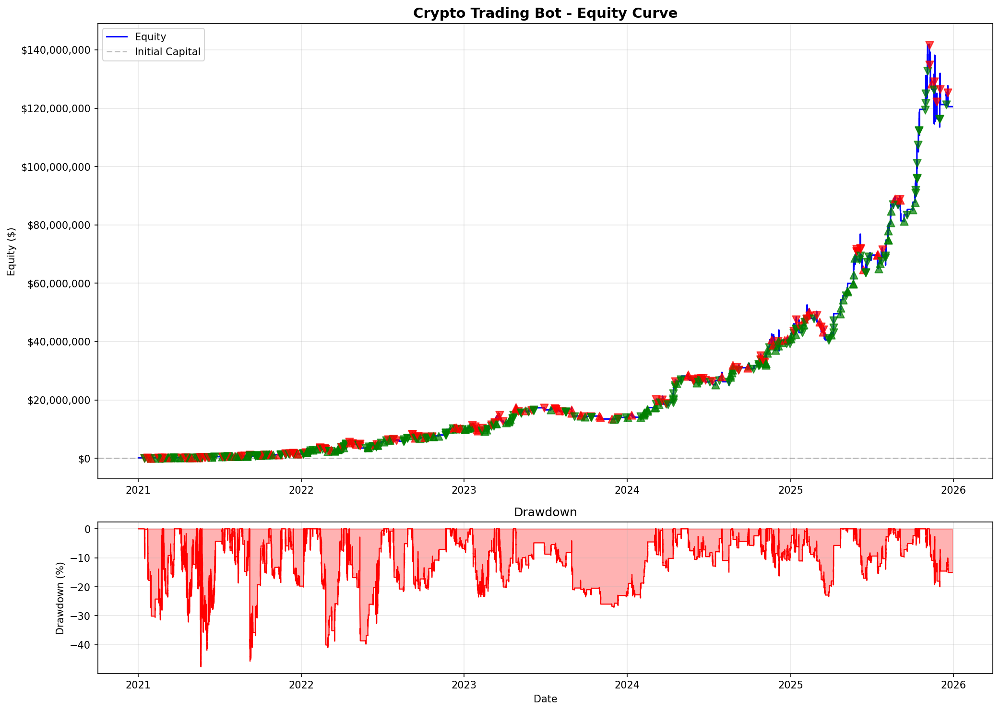

# Keltrader

A fully automatic algorithmic trading system that trades cryptocurrency perpetual futures 24/7. The bot identifies low-volatility consolidation patterns and enters positions when volatility expands, capturingmomentum breakouts in either direction.

**Capabilities:**
- Real-time signal generation using Bollinger Band / Keltner Channel squeeze detection
- Multi-asset portfolio management with dynamic position sizing
- Automated stop-loss and take-profit levels dynamically set by ATR
- Bayesian hyperparameter optimization with walk-forward validation
- Live trade journaling, P&L tracking, and performance monitoring
- Leveraged vs. Spot mode backtesting

Currently deployed live on DigitalOcean trading BTC, ETH, SOL, XRP, and DOGE perp futures on Coinbase International Exchange.

---

## Spot Trading Performance (2021-2025)


Spot trading DOGE, BTC, ETH, SOL, and XRP simultaneously:

| Metric | Value |
|--------|-------|
| Total Trades | 494 |
| Win Rate | **66.6%** |
| Profit Factor | 1.97 |
| Sharpe Ratio | **1.83** |
| Max Drawdown | 27.5% |
| Total Return | +1,751.9% |

*Longs: 199 | Shorts: 295 | Wins: 329 | Losses: 165*

---

## Leveraged Trading Performance (2021-2025)



Same strategy with maintenance margin of 0.67 and leverage levels set by Coinbase:

| Metric | Value |
|--------|-------|
| Total Trades | 508 |
| Win Rate | **67.1%** |
| Profit Factor | 1.82 |
| Sharpe Ratio | **1.85** |
| Max Drawdown | 47.6% |
| Total Return | +120,441.6% |
| Avg Leverage | 3.2x |
| Liquidations | 16 |

*Longs: 197 | Shorts: 311 | Wins: 341 | Losses: 167*

**Note:** Higher returns come with higher drawdown (47.6% vs 27.5%) and more liquidation risk.

---

## Strategy

Keltrader detects volatility compression (squeeze) followed by expansion breakouts.

**Entry Conditions:**
- Bollinger Bands contract inside Keltner Channels (squeeze)
- Squeeze releases with volume confirmation
- RSI filter rejects overbought longs / oversold shorts

**Exit Conditions:**
- ATR-based stop loss and take profit
- Maximum hold period (7 days)

**Timeframes:**
- Signal generation: 4h
- ATR calculation: 1h
- Trade execution: Real-time

---

## Individual Asset Performance

### BTC/USD

| Metric | Value |
|--------|-------|
| Total Trades | 128 |
| Win Rate | 68.0% |
| Profit Factor | 2.37 |
| Sharpe Ratio | 2.57 |
| Max Drawdown | 11.4% |
| Total Return | 287.2% |


### DOGE/USD

| Metric | Value |
|--------|-------|
| Total Trades | 96 |
| Win Rate | 76.0% |
| Profit Factor | 3.13 |
| Sharpe Ratio | 3.54 |
| Max Drawdown | 18.9% |
| Total Return | 1430.6% |


### SOL/USD

| Metric | Value |
|--------|-------|
| Total Trades | 90 |
| Win Rate | 67.8% |
| Profit Factor | 1.62 |
| Sharpe Ratio | 1.37 |
| Max Drawdown | 35.7% |
| Total Return | 202.9% |


### XRP/USD

| Metric | Value |
|--------|-------|
| Total Trades | 85 |
| Win Rate | 65.9% |
| Profit Factor | 1.89 |
| Sharpe Ratio | 1.72 |
| Max Drawdown | 19.2% |
| Total Return | 198.4% |


---

## Project Structure

```
├── coinbase_live_trader.py   # Live trading engine with monitoring
├── signal_generator.py       # BB Squeeze signal generation (redacted)
├── technical.py              # Technical indicators (BB, KC, RSI, ATR)
├── backtester.py             # Backtesting engine with leverage support
├── optimize.py               # Timeframe-specific optimizer
├── optimize_lib.py           # Core optimization library
├── permutation_test.py       # Overfitting detection
├── diagnostics.py            # Pre-deployment system checks (redacted)
├── data_utils.py             # Data fetching and caching
├── download_data.py          # Historical data downloader
├── run_backtest.py           # Backtest runner (redacted)
├── run_live_multi_asset.py   # Live trading configuration (redacted)
├── utils.py                  # Shared utilities
├── trading_bot_commands.md   # Server deployment guide (redacted)
└── requirements.txt          # Python dependencies
```

---

## Futures Contracts

The bot trades these Coinbase International perpetual futures:

| Contract | Asset | Contract Size | Leverage |
|----------|-------|---------------|----------|
| BIP-20DEC30-CDE | BTC | 0.01 BTC | ~4x |
| ETP-20DEC30-CDE | ETH | 0.1 ETH | ~4x |
| SLP-20DEC30-CDE | SOL | 5 SOL | ~2.7x |
| XPP-20DEC30-CDE | XRP | 500 XRP | ~2.6x |
| DOP-20DEC30-CDE | DOGE | 5000 DOGE | ~2x |

---

## Disclaimer

This software is for educational purposes only. Cryptocurrency trading involves substantial risk of loss. Past performance does not guarantee future results. Never trade with money you cannot afford to lose.

---

**Version**: 2.1.0 | **Last Updated**: January 2026