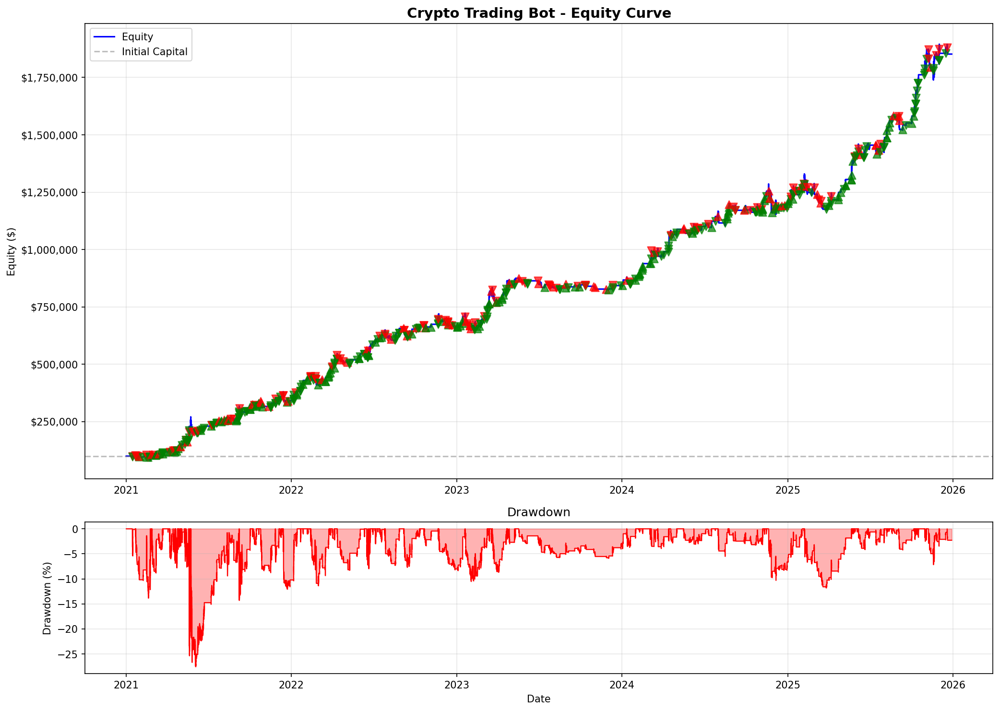
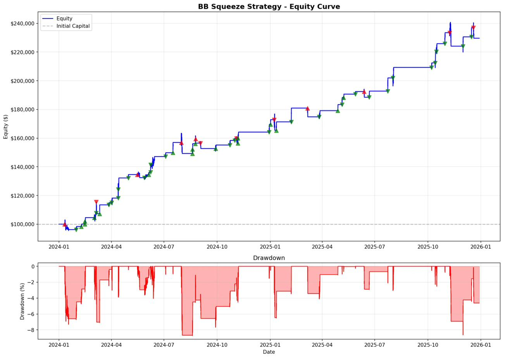

# Keltrader

A fully automated algorithmic trading system that trades cryptocurrency perpetual futures 24/7. The bot identifies low-volatility consolidation patterns and enters positions when volatility expands, capturing momentum breakouts in either direction.

**Core Capabilities:**
- Real-time signal generation using Bollinger Band / Keltner Channel squeeze detection
- Multi-asset portfolio management with dynamic position sizing
- ATR-based risk management with automated stop-loss and take-profit execution
- Bayesian hyperparameter optimization with walk-forward validation
- Complete trade journaling, P&L tracking, and performance monitoring
- Conservative leverage management (overnight margin rates only)

Currently deployed live on DigitalOcean trading BTC, ETH, SOL, XRP, and DOGE futures on Coinbase International Exchange.

---

## Performance (2021-2025)



Trading DOGE, BTC, ETH, SOL, and XRP simultaneously:

| Metric | Value |
|--------|-------|
| Total Trades | 494 |
| Win Rate | 66.6% |
| Profit Factor | 1.97 |
| Sharpe Ratio | 1.83 |
| Max Drawdown | 27.5% |
| Total Return | +1,751.9% |

*Longs: 199 | Shorts: 295 | Wins: 329 | Losses: 165*

---

## Performance with Leverage (2021-2025)


Same strategy with conservative leverage (overnight margin rates only):

| Metric | Value |
|--------|-------|
| Total Trades | 508 |
| Win Rate | 67.1% |
| Profit Factor | 1.82 |
| Sharpe Ratio | 1.85 |
| Max Drawdown | 47.6% |
| Total Return | +120,441.6% |
| Avg Leverage | 3.2x |
| Liquidations | 16 |

*Longs: 197 | Shorts: 311 | Wins: 341 | Losses: 167*

**Note:** Higher returns come with significantly higher drawdown (47.6% vs 27.5%) and liquidation risk. The bot uses conservative overnight margin rates only—no 10x intraday leverage.

---

## Strategy

Keltrader detects volatility compression (squeeze) followed by expansion breakouts.

**Entry Conditions:**
- Bollinger Bands contract inside Keltner Channels (squeeze)
- Squeeze releases with volume confirmation
- RSI filter rejects overbought longs / oversold shorts

**Exit Conditions:**
- ATR-based stop loss and take profit
- Maximum hold period (7 days)
- Daily loss limit (3%)

**Timeframes:**
- Signal generation: 4h
- ATR calculation: 1h
- Trade execution: Real-time

**Risk Management:**
- Max 2 concurrent positions across all assets
- Conservative overnight margin rates only (no 10x intraday leverage)
- Position sizing: 20-50% of capital per trade

---

## Individual Asset Performance

### BTC/USD

| Metric | Value |
|--------|-------|
| Total Trades | 128 |
| Win Rate | 68.0% |
| Profit Factor | 2.37 |
| Sharpe Ratio | 2.57 |
| Max Drawdown | 11.4% |
| Total Return | 287.2% |


### DOGE/USD

| Metric | Value |
|--------|-------|
| Total Trades | 96 |
| Win Rate | 76.0% |
| Profit Factor | 3.13 |
| Sharpe Ratio | 3.54 |
| Max Drawdown | 18.9% |
| Total Return | 1430.6% |


### SOL/USD

| Metric | Value |
|--------|-------|
| Total Trades | 90 |
| Win Rate | 67.8% |
| Profit Factor | 1.62 |
| Sharpe Ratio | 1.37 |
| Max Drawdown | 35.7% |
| Total Return | 202.9% |


### XRP/USD

| Metric | Value |
|--------|-------|
| Total Trades | 85 |
| Win Rate | 65.9% |
| Profit Factor | 1.89 |
| Sharpe Ratio | 1.72 |
| Max Drawdown | 19.2% |
| Total Return | 198.4% |



---

## Installation

```bash
git clone https://github.com/jicheolha/crypto-trading-bot.git
cd crypto-trading-bot

python3 -m venv venv
source venv/bin/activate
pip install -r requirements.txt

export COINBASE_API_KEY='your_key'
export COINBASE_API_SECRET='your_secret'
```

---

## Usage

```bash
# Download historical data (required first time)
python download_data.py

# Run backtest (spot mode)
python run_backtest.py

# Run backtest with leverage simulation
python run_backtest.py --leverage

# Optimize parameters
python optimize.py --trials 200

# Optimize specific timeframe combination
python optimize.py --signal-tf 4h --atr-tf 1h --trials 100

# Run diagnostics before live trading
python diagnostics.py

# Start live trading
python run_live_multi_asset.py
```

---

## Configuration

Key parameters in `run_live_multi_asset.py`:

```python
# Timeframes (use format: 1m, 5m, 15m, 30m, 1h, 4h, 1d)
SIGNAL_TIMEFRAME = '4h'    # Signal generation
ATR_TIMEFRAME = '1h'       # ATR for stops/targets

# Position sizing
BASE_POSITION = 0.4        # 40% base position
MIN_POSITION = 0.2         # 20% minimum
MAX_POSITION = 0.5         # 50% maximum

# Risk management
MAX_POSITIONS = 2          # Max concurrent positions
MAX_DAILY_LOSS = 0.03      # 3% daily loss limit
MAX_HOLD_DAYS = 7          # Maximum hold time

# Bot settings
CHECK_INTERVAL = 30        # Check every 30 seconds
```

---

## Project Structure

```
├── coinbase_live_trader.py   # Live trading engine with monitoring
├── signal_generator.py       # BB Squeeze signal generation
├── technical.py              # Technical indicators (BB, KC, RSI, ATR)
├── backtester.py             # Backtesting engine with leverage support
├── optimize.py               # Timeframe-specific optimizer
├── optimize_lib.py           # Core optimization library
├── permutation_test.py       # Overfitting detection
├── diagnostics.py            # Pre-deployment system checks
├── data_utils.py             # Data fetching and caching
├── download_data.py          # Historical data downloader
├── run_backtest.py           # Backtest runner
├── run_live_multi_asset.py   # Live trading configuration
├── utils.py                  # Shared utilities
├── trading_bot_commands.md   # Server deployment guide
└── requirements.txt          # Python dependencies
```

---

## Futures Contracts

The bot trades these Coinbase International perpetual futures:

| Contract | Asset | Contract Size | Leverage |
|----------|-------|---------------|----------|
| BIP-20DEC30-CDE | BTC | 0.01 BTC | ~4x |
| ETP-20DEC30-CDE | ETH | 0.1 ETH | ~4x |
| SLP-20DEC30-CDE | SOL | 5 SOL | ~2.7x |
| XPP-20DEC30-CDE | XRP | 500 XRP | ~2.6x |
| DOP-20DEC30-CDE | DOGE | 5000 DOGE | ~2x |

*Leverage shown is conservative overnight rates. The bot does not use higher intraday leverage.*

---

## Monitoring

The bot includes professional-grade monitoring:

- **Trade Journal**: CSV log of all trades with entry/exit details
- **Daily Summary**: Daily P&L and win rate tracking
- **State Persistence**: Survives restarts without losing position data
- **Drawdown Alerts**: Warnings at 5% and 10% drawdown levels
- **Performance Drift**: Comparison against backtest expectations

Data stored in `trading_data/` directory.

---

## Server Deployment

See `trading_bot_commands.md` for complete deployment guide.

Quick reference:
```bash
# Deploy and restart
scp *.py root@YOUR_SERVER:/home/trader/bot/ && \
ssh root@YOUR_SERVER "systemctl restart trading-bot && journalctl -u trading-bot -f"

# View logs
ssh root@YOUR_SERVER "journalctl -u trading-bot -f --output=cat"

# Check status
ssh root@YOUR_SERVER "systemctl status trading-bot"
```

---

## Disclaimer

This software is for educational purposes only. Cryptocurrency trading involves substantial risk of loss. Past performance does not guarantee future results. Never trade with money you cannot afford to lose.

---

**Version**: 2.1.0 | **Last Updated**: January 2026