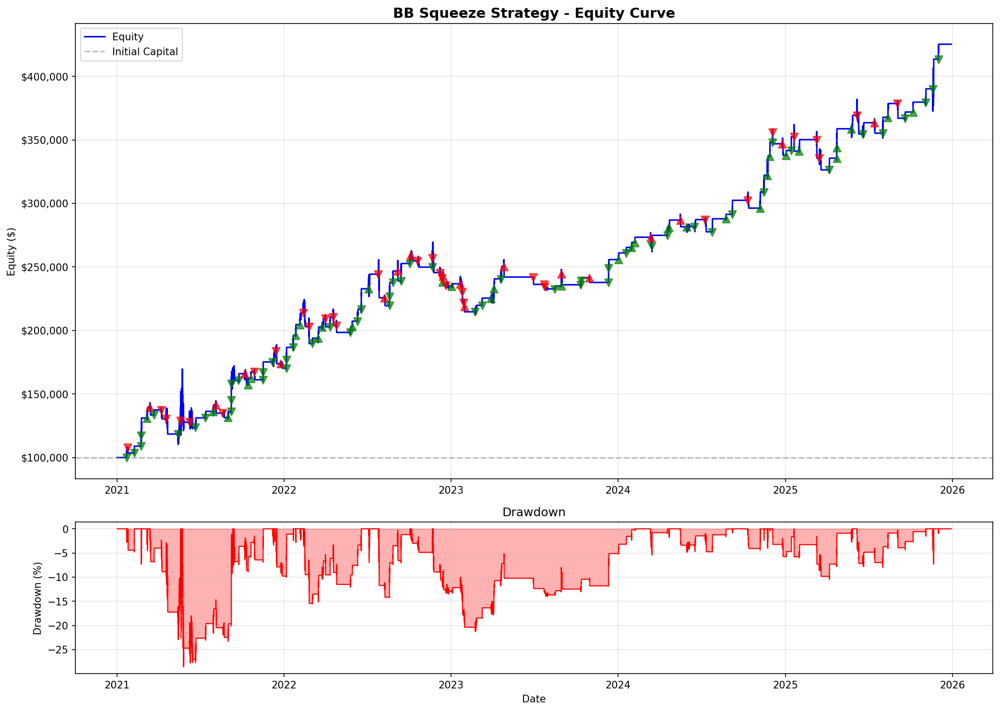
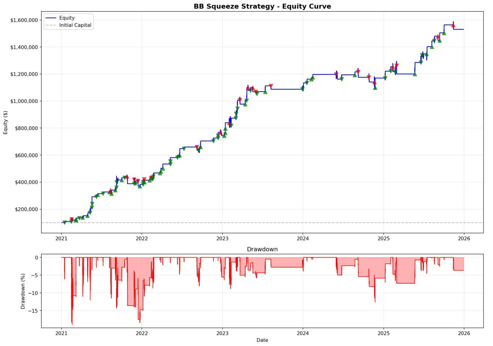

# Live Algorithmic Crypto Trading Bot

## Overview

This is an algorithmic trading system designed for cryptocurrency futures markets. It identifies low-volatility consolidation periods (squeezes) followed by breakout opportunities. The system supports 1) data mining and management 2) backtesting 3) parameter optimization 4) Monte Carlo permutation testing and 5) live trading with risk management. Live trading is implemented on Coinbase crypto futures (e.g. ETH perps) via their Advanced Trade API. This bot has demonstrated an average annualized return of 39.7%, Sharpe Ratio of 2.35, and max drawdown of 22.7% across BTC, ETH, DOGE, and SOL over five years. Default comission is 0.05% and slippage is 0.02%. Current parameters are optimized only for one-year price data of Bitcoin to minimize overfitting.  

### Key Features

- **Multi-Timeframe Analysis**: Timeframe customization for signal generation, entry and exit, and trade execution frequency
- **Indicators**: Bollinger Bands, Keltner Channels, RSI, ATR, and normalized momentum
- **Dynamic Position Sizing**: Allocation adjusts based on squeeze quality, volume confirmation, and drawdown state
- **Backtesting**: Minute-by-minute simulation of up to 5 years with commission and slippage customization
- **Optimization**: Hyperparameter tuning using Bayesian, Random, Grid Search, or Walk-Forward methods
- **Live Trading**: Real-time trading capability with Coinbase Advanced Trade API
- **Risk Management**: Multiple protective layers including ATR-based stops, daily loss limits, and maximum hold periods

---

## Strategy

### Bollinger Band Squeeze

The Bollinger Band Squeeze is a volatility-based pattern that identifies periods of low volatility followed by expansion. The strategy exploits the market tendency to alternate between consolidation and trending phases.

**Pattern Recognition**:
1. **Squeeze Formation**: Bollinger Bands contract inside Keltner Channels, indicating volatility compression
2. **Minimum Duration**: Squeeze must persist for a minimum number of bars to filter false signals
3. **Breakout Detection**: Bollinger Bands expand outside Keltner Channels on current bar
4. **Volume Confirmation**: Breakout must be accompanied by volume above a threshold relative to the moving average
5. **Direction Determination**: Entry direction based on momentum sign and price position relative to bands
6. **RSI Filter**: Rejects long entries when RSI is overbought, short entries when RSI is oversold

### Entry Conditions

All conditions must be satisfied simultaneously:
- Squeeze duration meets minimum bar requirement
- Bollinger Bands expanded outside Keltner Channels (squeeze released)
- Current volume ratio meets threshold
- RSI within acceptable range for direction
- Available capital and position limits not exceeded
- Daily loss limit not breached

### Exit Logic

Positions are closed when any of the following conditions are met:
- **Stop Loss**: Entry price minus/plus ATR multiplier, depending on direction
- **Take Profit**: Entry price plus/minus ATR multiplier, depending on direction
- **Time-Based Exit**: Automatic closure after maximum hold period to prevent indefinite holding
- **Daily Loss Limit**: Trading halted if account experiences threshold drawdown in single day

### Position Sizing Algorithm

Base allocation starts at a configurable percentage of available capital, then adjusts based on setup quality:

```
base_allocation = configurable base percentage

Adjustments:
- If squeeze duration >= threshold: increase allocation
- If volume ratio >= threshold: increase allocation
- If absolute momentum >= threshold: increase allocation
- If consecutive losses >= threshold: decrease allocation

Final position size constrained to configured min/max range
```

---

## Performance Results (2021.01.01-2025.12.29)

### BTC/USD

| Metric | Value |
|--------|-------|
| Total Trades | 128 |
| Win Rate | 68.0% |
| Profit Factor | 2.37 |
| Sharpe Ratio | 2.57 |
| Maximum Drawdown | 11.4% |
| Total Return (after commision and slippage) | 287.2% |


### ETH/USD

| Metric | Value |
|--------|-------|
| Total Trades | 134 |
| Win Rate | 63.4% |
| Profit Factor | 2.01 |
| Sharpe Ratio | 1.92 |
| Maximum Drawdown | 24.8% |
| Total Return (after commision and slippage) | 271.1% |



### DOGE/USD

| Metric | Value |
|--------|-------|
| Total Trades | 96 |
| Win Rate | 76.0% |
| Profit Factor | 3.13 |
| Sharpe Ratio | 3.54 |
| Maximum Drawdown | 18.9% |
| Total Return (after commision and slippage) | 1430.6% |



### SOL/USD

| Metric | Value |
|--------|-------|
| Total Trades | 90 |
| Win Rate | 67.8% |
| Profit Factor | 1.62 |
| Sharpe Ratio | 1.37 |
| Maximum Drawdown | 35.7% |
| Total Return (after commision and slippage) | 202.9% |


**Disclaimer**: Past performance does not guarantee future results. These results are from backtesting on historical data.

---

## Installation and Setup

### Requirements

- Python 3.11 or higher
- API credentials from supported exchange (Coinbase Advanced Trade)

### Installation Steps

```bash
# Clone repository
git clone https://github.com/jicheolha/crypto-trading-bot.git
cd crypto-trading-bot

# Create virtual environment
python3 -m venv venv
source venv/bin/activate  # On Windows: venv\Scripts\activate

# Install dependencies
pip install -r requirements.txt
```

### Configuration

```bash
# Copy example configuration
cp config.example.py config.py

# Edit configuration file with your settings
nano config.py
```

**Important**: Never commit `config.py` to version control. Use environment variables for API credentials in production.

```python
# Recommended: Use environment variables
import os

COINBASE_API_KEY = os.environ.get('COINBASE_API_KEY')
COINBASE_API_SECRET = os.environ.get('COINBASE_API_SECRET')
```

---

## Usage

### Running Backtests

```bash
# Execute backtest with default parameters
python run_backtest.py

# Output includes:
# - Trade log with date, direction, entry/exit prices, duration, and P&L
# - Summary statistics (Sharpe ratio, profit factor, win rate, and total return)
# - Equity curves
```

### Parameter Optimization

The optimization module supports multiple methods for hyperparameter tuning:

```bash
# Bayesian optimization (recommended)
python optimize.py --method bayesian

# Random search
python optimize.py --method random

# Walk-forward analysis
python optimize.py --method walkforward --folds 5

# Grid search
python optimize.py --method grid
```

### Live Trading

**Warning**: Always begin with paper trading to validate system behavior.

```bash
# Set environment variables
export COINBASE_API_KEY='your_api_key'
export COINBASE_API_SECRET='your_api_secret'

# Launch trading bot
python run_eth_futures_simple.py
```

---

### Technology Stack

| Component | Technology |
|-----------|-----------|
| Language | Python 3.11+ |
| Data Processing | Pandas, NumPy |
| Visualization | Matplotlib |
| Optimization | Optuna |
| Exchange APIs | CCXT, Coinbase Advanced Trade |
| Authentication | HMAC-SHA256 via cryptography library |
| Caching | Pickle |

---

## License

This project is licensed under the MIT License. See LICENSE file for full text.

---

## Disclaimer

**This software is provided for educational and research purposes only.**

Cryptocurrency trading involves substantial risk of loss. Past performance does not guarantee future results. Never invest more than you can afford to lose. This software is not financial advice. Users are responsible for their own trading decisions and any resulting gains or losses.

The authors and contributors are not liable for any financial losses incurred through use of this software. Always test strategies with paper trading before deploying real capital.

---

## Contact

For questions, bug reports, or collaboration opportunities:

- GitHub Issues: [github.com/jicheolha/crypto-trading-bot/issues](https://github.com/jicheolha/crypto-trading-bot/issues)
- Repository: [github.com/jicheolha/crypto-trading-bot](https://github.com/jicheolha/crypto-trading-bot)

---

**Version**: 1.0.0  
**Last Updated**: January 2026