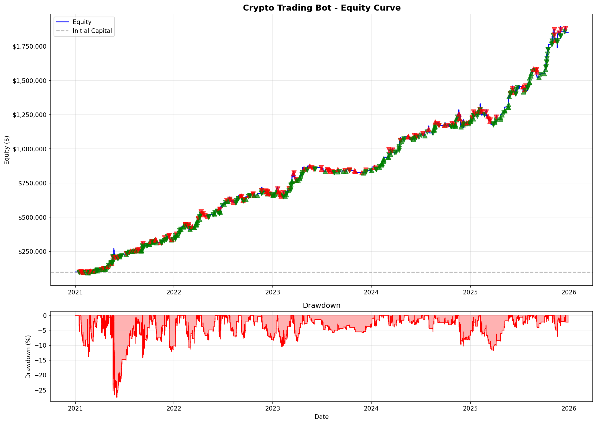
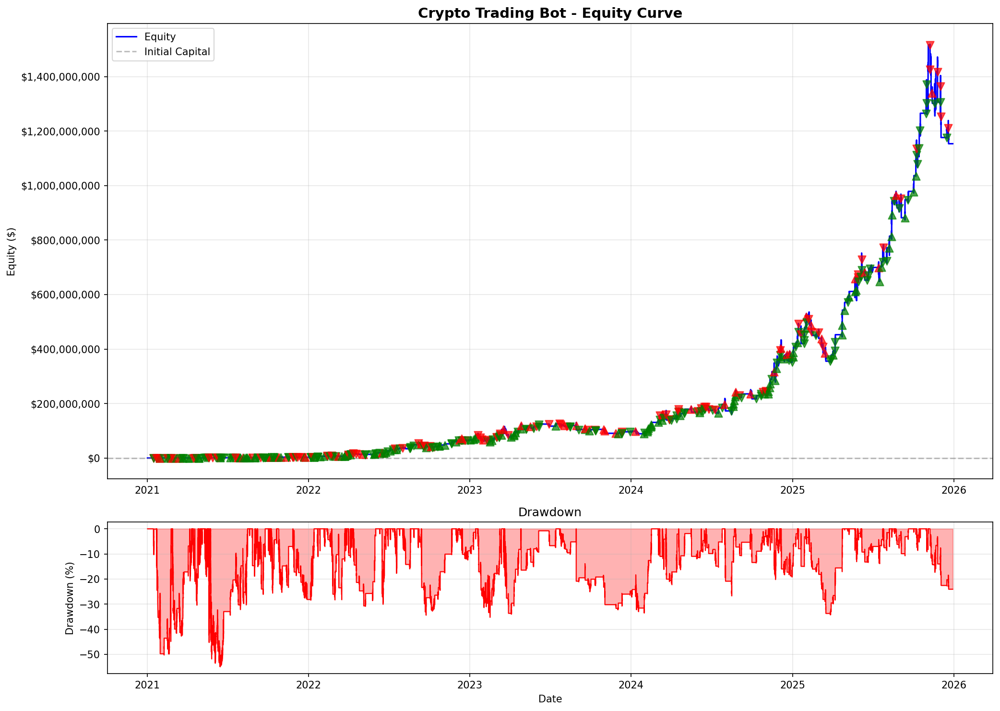
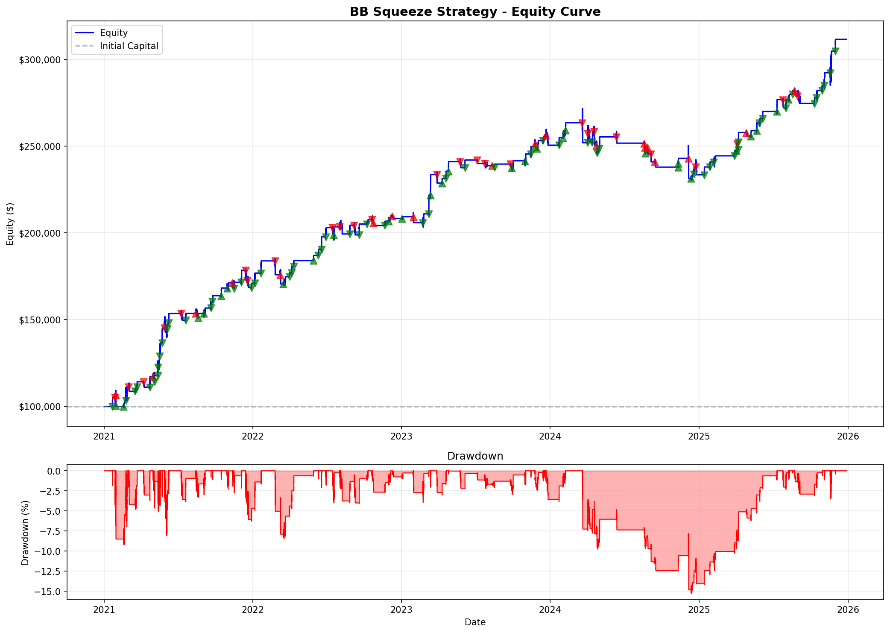
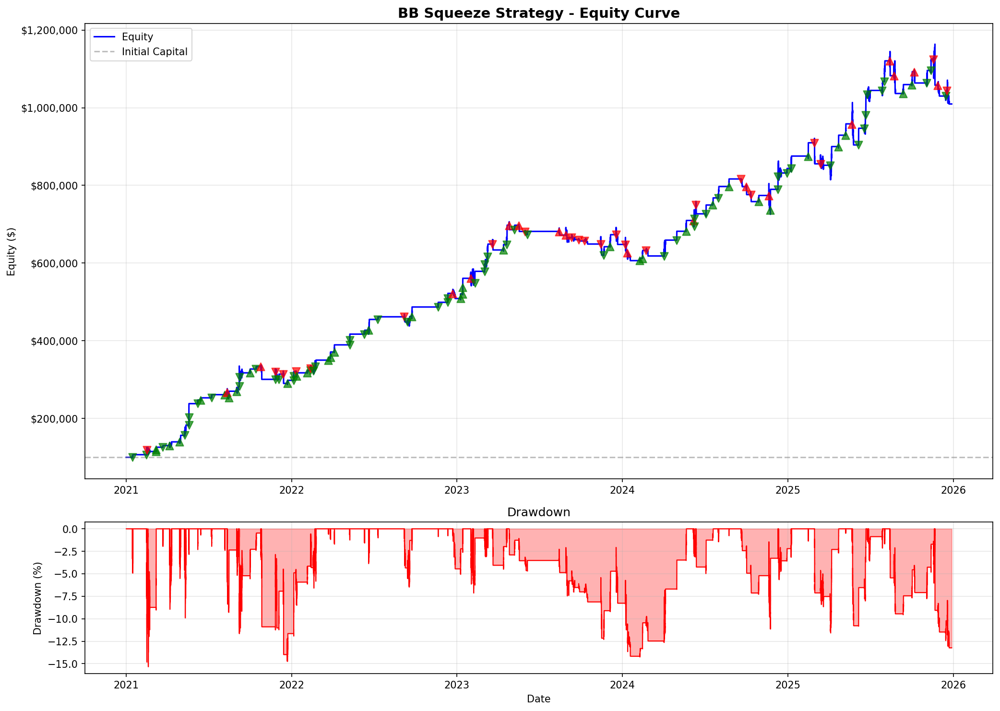
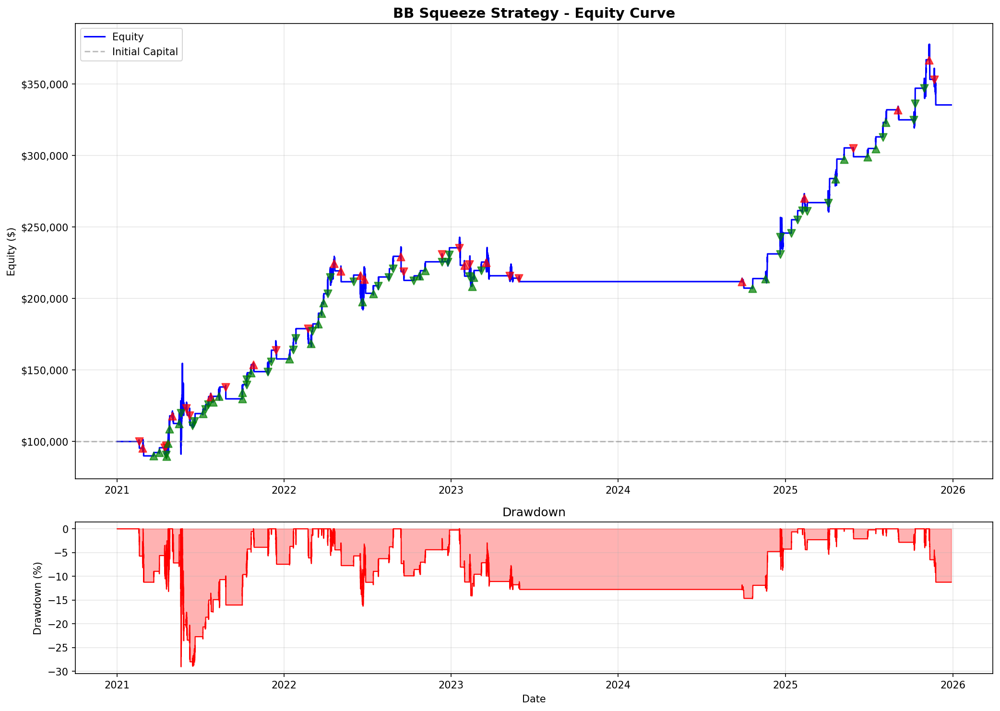
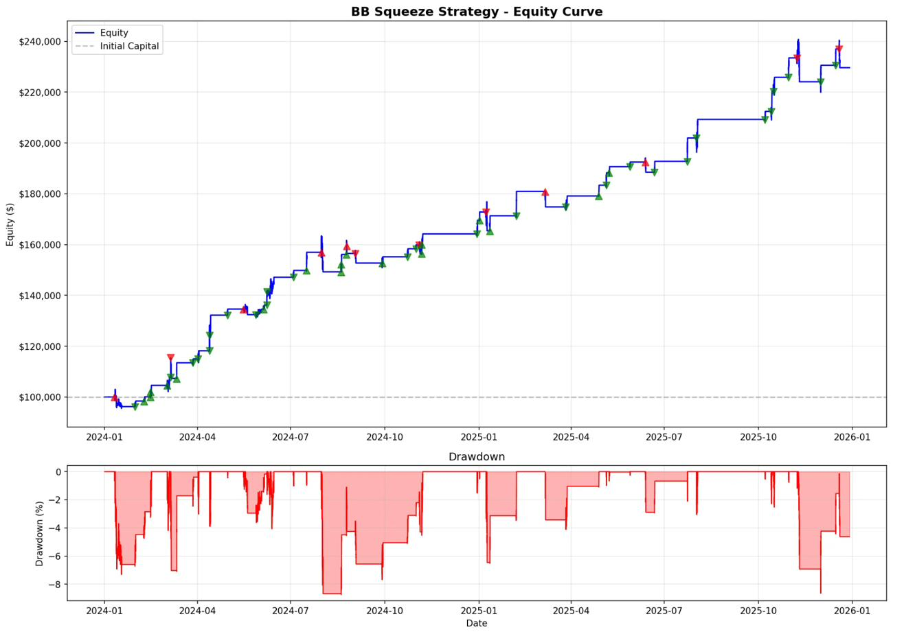

# Keltrader

Keltrader is a robust, market-neutral crypto trading bot. Identifies low-volatility consolidation periods and enters position when volatility expands, indicating momentum breakouts in either direction. Has a Sharpe ratio of ~2.0 and win rate of ~70%. Deployed 24/7 on a cloud server trading BTC, ETH, SOL, XRP, and DOGE perp futures on Coinbase exchange. 


**Key Capabilities:**
- Live multi-asset trading on Coinbase using Advanced API
- Signal generation from underlying crypto asset
- Stop-loss and take-profit execution using ATR
- Bayesian hyperparameter optimization
- Monte Carlo Permutation Testing
- Data mining and management (~6 years)
- Backtesting with spot vs. leverage mode
- Telegram notifications

**Disclaimer:** Certain files have been redacted to protect the author's trading edge. 

---

## Spot Trading Performance (2021-2025)



Spot trading DOGE, BTC, ETH, SOL, and XRP simultaneously:

| Metric | Value |
|--------|-------|
| Total Trades | 494 |
| Win Rate | **66.6%** |
| Profit Factor | 1.97 |
| Sharpe Ratio | **1.83** |
| Max Drawdown | 27.5% |
| Total Return | +1,751.9% |

*Longs: 199 | Shorts: 295 | Wins: 329 | Losses: 165*

---

## Leveraged Trading Performance (2021-2025)



Same strategy with maintenance margin of 0.67 and margin levels set by Coinbase:

| Metric | Value |
|--------|-------|
| Total Trades | 544 |
| Win Rate | **66.7%** |
| Profit Factor | 1.95 |
| Total P&L | $+4,278,184 |
| Sharpe Ratio | **1.92** |
| Max Drawdown | 24.5% |
| Total Return | +4,088.0% |
| Avg Leverage | 2.7x |
| Liquidations | 10 |

*Longs: 209 | Shorts: 335 | Wins: 363 | Losses: 181*

---

## Strategy

Keltrader detects price breakouts preceded by volatility compressions (squeeze).

**Entry Conditions:**
- Bollinger Bands contract inside Keltner Channels
- Squeeze releases under minimum volume threshold
- RSI filter rejects overbought longs / oversold shorts

**Exit Conditions:**
- ATR-based stop loss and take profit
- Maximum hold period (7 days)
- Liquidation

---

## Futures Contracts

The bot trades these perpetual futures with direction-specific margin rates set by Coinbase:

| Contract | Asset | Contract Size | LONG Leverage | SHORT Leverage |
|----------|-------|---------------|---------------|----------------|
| BIP-20DEC30-CDE | BTC | 0.01 BTC | ~4.1x | ~3.3x |
| ETP-20DEC30-CDE | ETH | 0.1 ETH | ~4.0x | ~2.9x |
| SLP-20DEC30-CDE | SOL | 5 SOL | ~2.7x | ~1.8x |
| XPP-20DEC30-CDE | XRP | 500 XRP | ~2.6x | ~1.6x |
| DOP-20DEC30-CDE | DOGE | 5000 DOGE | ~2.0x | ~1.0x |

---

## Individual Asset Performance

### BTC/USD

| Metric | Value |
|--------|-------|
| Total Trades | 128 |
| Win Rate | 68.0% |
| Profit Factor | 2.37 |
| Sharpe Ratio | 2.57 |
| Max Drawdown | 11.4% |
| Total Return | 287.2% |



### DOGE/USD

| Metric | Value |
|--------|-------|
| Total Trades | 96 |
| Win Rate | 76.0% |
| Profit Factor | 3.13 |
| Sharpe Ratio | 3.54 |
| Max Drawdown | 18.9% |
| Total Return | 1430.6% |



### SOL/USD

| Metric | Value |
|--------|-------|
| Total Trades | 90 |
| Win Rate | 67.8% |
| Profit Factor | 1.62 |
| Sharpe Ratio | 1.37 |
| Max Drawdown | 35.7% |
| Total Return | 202.9% |



### XRP/USD

| Metric | Value |
|--------|-------|
| Total Trades | 85 |
| Win Rate | 65.9% |
| Profit Factor | 1.89 |
| Sharpe Ratio | 1.72 |
| Max Drawdown | 19.2% |
| Total Return | 198.4% |



---

## Project Structure

```
├── coinbase_live_trader.py   # Live trading engine with notifications (redacted)
├── data_utils.py             # Data fetching and caching
├── signal_generator.py       # BB Squeeze signal generation (redacted)
├── technical.py              # Technical indicators
├── backtester.py             # Backtesting engine
├── optimize.py               # Optimizer
├── optimize_lib.py           # Optimization library
├── permutation_test.py       # Overfitting test
├── utils.py                  # Shared utilities
├── diagnostics.py            # Pre-deployment system checks (redacted)
├── download_data.py          # Historical data downloader (redacted)
├── run_backtest.py           # Backtest runner (redacted)
├── run_live_multi_asset.py   # Live trading configuration (redacted)
└── requirements.txt          # Python dependencies
```

---

## Disclaimer

This software is for educational purposes only. Cryptocurrency trading involves substantial risk of loss. Past performance does not guarantee future results. Never trade with money you cannot afford to lose.

---

**Version**: 2.2.0 | **Last Updated**: January 2026